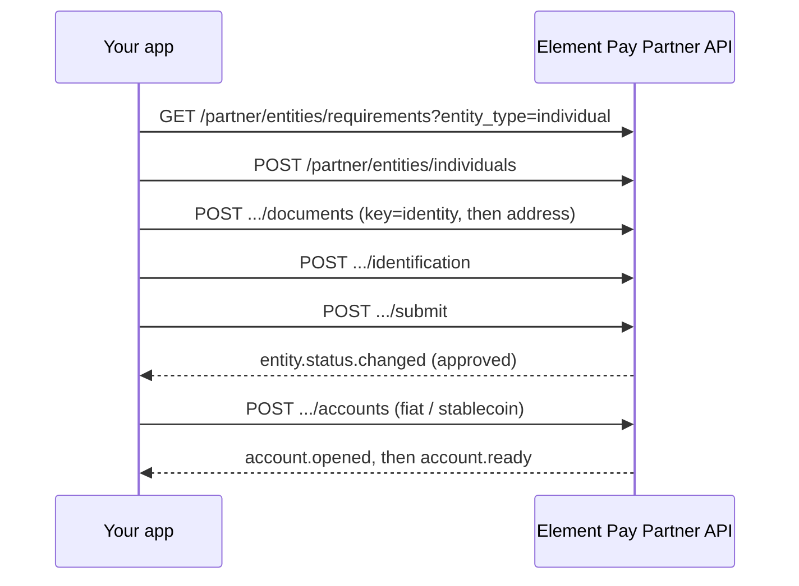

# Entity KYC

Onboard your end-customer as an **entity** (individual or business), then wait for `approved` before [opening accounts](/deposit-accounts/accounts). See [Overview](/deposit-accounts/overview) for concepts and auth.

<Note>
All calls use `X-API-Key` and `$BASE` = `https://sandbox.elementpay.net/api/v1`. See [Authentication](/authentication).
</Note>

## How KYC works

Both individuals and businesses follow the same shape:

<Steps>
  <Step title="Read requirements">
    Call the requirements endpoint to get the authoritative list of fields and documents for the entity type. Collect exactly what it returns; do not guess or hardcode.
  </Step>
  <Step title="Create the entity">
    Create an individual or business. The response returns `data.id` (the entity id). Save it.
  </Step>
  <Step title="Attach documents and details">
    Upload the required documents, then attach identification (individuals) or a business profile (businesses).
  </Step>
  <Step title="Submit and wait">
    Submit for review and wait for `approved` (via the `entity.status.changed` webhook or by polling).
  </Step>
</Steps>

### Where to find the requirements

The requirements endpoint is the source of truth for which fields and documents each entity type needs:

```bash
curl -sS "$BASE/partner/entities/requirements?entity_type=individual" \
  -H "X-API-Key: $API_KEY" | jq '.data'

curl -sS "$BASE/partner/entities/requirements?entity_type=business" \
  -H "X-API-Key: $API_KEY" | jq '.data'
```

### Documents you will need

| Entity type | Documents |
|-------------|-----------|
| **Individual** | One **identity** document (`key: identity`) and one **proof of address** document (`key: address`). One document per key is enough. |
| **Business** | Company documents (`certificate_of_incorporation`, `memorandum_of_association`, `proof_of_address`, `tax_verification`) plus each officer's own `identity` and `address` documents. |

Always confirm the exact set against `GET /partner/entities/requirements` before collecting documents, since program requirements can vary.

### Business: single- vs multi-officer

Both individual and business can reach **`approved`** on live. For businesses:

| Path | Guidance |
|------|----------|
| **Single officer** | Prefer this for first integrations — one officer with their own identity + proof-of-address documents |
| **Multi-officer** | Each officer needs **distinct** document uploads. Sharing one PoA file or the **same `document_id`** across officers can fail review — upload separate docs (or distinct document rows) per officer |

If multi-officer KYB fails with document / PoA errors, retry with a single-officer profile or unique documents per officer before opening deposit accounts.

### Retrieve an entity by id

After a successful create, use the returned id to check status at any time, or list entities filtered by `customer_ref` or `status`:

```bash
curl -sS "$BASE/partner/entities/$ENTITY_ID" \
  -H "X-API-Key: $API_KEY" | jq '.data | {id, status, customer_ref, entity_type}'

curl -sS "$BASE/partner/entities?customer_ref=partner-cust-001" \
  -H "X-API-Key: $API_KEY" | jq '.data'
```

## Individual flow



### 1. Requirements

```bash
curl -sS "$BASE/partner/entities/requirements?entity_type=individual" \
  -H "X-API-Key: $API_KEY" | jq '.data'
```

Use the returned field and document list; do not hardcode KYC shapes from this guide alone.

### 2. Create individual

Required: `customer_ref`, `first_name`, `last_name`, `email`, `date_of_birth` (**YYYY-MM-DD**, not `dob`), `country_of_residence` (ISO-2), `phone` (E.164), `gender` (`m` / `f`).

```bash
curl -sS -X POST "$BASE/partner/entities/individuals" \
  -H "X-API-Key: $API_KEY" \
  -H "Content-Type: application/json" \
  -d '{
    "customer_ref": "partner-cust-001",
    "first_name": "Jane",
    "last_name": "Doe",
    "email": "jane@example.com",
    "date_of_birth": "1990-01-15",
    "country_of_residence": "GB",
    "phone": "+447700900123",
    "gender": "f"
  }' | jq '.data'
```

Save `data.id` (entity id); you can [retrieve the entity](#retrieve-an-entity-by-id) with it at any time. Optional fields: `middle_name`, `display_name`, `parent_entity_id`, `liveness_check_id`.

### 3. Upload documents

Individuals need **one identity document** (`key: identity`) and **one proof of address** (`key: address`). Send documents as JSON with **`content_base64`** (not multipart). Fields: `key`, `filename`, `content_base64`, `content_type` (default `application/pdf`).

```bash
export ENTITY_ID="11"   # from create response

# Identity document (one required)
curl -sS -X POST "$BASE/partner/entities/$ENTITY_ID/documents" \
  -H "X-API-Key: $API_KEY" \
  -H "Content-Type: application/json" \
  -d '{
    "key": "identity",
    "filename": "passport.pdf",
    "content_type": "application/pdf",
    "content_base64": "<BASE64>"
  }' | jq '.data'

# Proof of address (one required)
curl -sS -X POST "$BASE/partner/entities/$ENTITY_ID/documents" \
  -H "X-API-Key: $API_KEY" \
  -H "Content-Type: application/json" \
  -d '{
    "key": "address",
    "filename": "utility_bill.pdf",
    "content_type": "application/pdf",
    "content_base64": "<BASE64>"
  }' | jq '.data'
```

Save each returned document `id` for the identification step.

### 4. Identification

Required before submit for individuals. This step links the documents you uploaded in [step 3](#3-upload-documents) to the residential address.

Each `document_id` below is the **`id` returned by the document upload call** (`POST .../documents`) in step 3: use the identity document's id for `identity_document.document_id`, and the proof-of-address document's id for `proof_of_address.document_id`.

Identity `type`: `international_passport` \| `drivers_license` \| `national_id` (aliases like `passport` are accepted).  
Proof-of-address `type`: `utility_bill` \| `bank_statement`.

```bash
curl -sS -X POST "$BASE/partner/entities/$ENTITY_ID/identification" \
  -H "X-API-Key: $API_KEY" \
  -H "Content-Type: application/json" \
  -d '{
    "address": {
      "line_1": "1 Example Street",
      "city": "London",
      "country": "GB",
      "postal_code": "E1 6AN"
    },
    "identity_document": {
      "document_id": "<identity_doc_id>",
      "type": "international_passport",
      "number": "P1234567",
      "issuing_country": "GB",
      "issue_date": "2020-01-01"
    },
    "proof_of_address": {
      "document_id": "<address_doc_id>",
      "type": "utility_bill"
    }
  }' | jq '.data'
```

### 5. Submit for review

```bash
curl -sS -X POST "$BASE/partner/entities/$ENTITY_ID/submit" \
  -H "X-API-Key: $API_KEY" \
  -H "Content-Type: application/json" \
  -d '{}' | jq '.data'
```

Optional body: `{ "liveness_check_id": "..." }` if compliance requires it after a prior attempt. Sandbox individuals often reach `approved` without liveness.

### 6. Wait for `approved`

- Prefer the webhook **`entity.status.changed`** ([Webhooks](/webhooks)).
- Backup: poll `GET /partner/entities/{id}` (see [Retrieve an entity by id](#retrieve-an-entity-by-id)).

Do **not** open accounts until `status` is `approved`.

## Business flow

Same create, submit, approve, open-accounts pattern; KYB adds company documents and a business profile.

1. `GET /partner/entities/requirements?entity_type=business`
2. `POST /partner/entities/businesses`
3. Upload documents (`certificate_of_incorporation`, `memorandum_of_association`, `proof_of_address`, `tax_verification`, plus each officer's `identity` and `address`)
4. `POST /partner/entities/{id}/business-profile` (contact, usage metadata, officers)
5. `POST /partner/entities/{id}/submit`
6. Wait for `approved` (business KYB may stay `submitted` longer)

### Create business (example)

```bash
curl -sS -X POST "$BASE/partner/entities/businesses" \
  -H "X-API-Key: $API_KEY" \
  -H "Content-Type: application/json" \
  -d '{
    "customer_ref": "partner-biz-001",
    "legal_name": "Acme Trading Ltd",
    "email": "treasury@acme.example",
    "business_type": "llc",
    "country_of_incorporation": "GB",
    "registered_address": {
      "line_1": "10 Business Park",
      "city": "London",
      "country_code": "GB",
      "postal_code": "EC2A 4BX"
    },
    "industry": "0763",
    "registration_number": "12345678",
    "description": "B2B payments for e-commerce merchants",
    "incorporation_meta": {
      "year": 2018,
      "month": 6,
      "country": "GB",
      "state": "England"
    }
  }' | jq '.data'
```

### Business profile (example)

Required before submit: `phone`, `website`, monthly volume fields, `customer_types`, `funding_source`, and at least one **officer** (with their own address and identity / proof-of-address documents). Prefer **one officer** for a reliable first path; multi-officer must not reuse the same `document_id` for shared PoA across officers — see business officer guidance above. The authoritative list is `GET /partner/entities/requirements?entity_type=business`.

Field notes:

- `customer_types`: required **string** (not a list). There is no fixed enum on the partner API; use a short descriptor such as `businesses` or `individuals`.
- `funding_source`: required string, for example `bank_account`.
- `sales_channel`: optional string, for example `online`.

```bash
curl -sS -X POST "$BASE/partner/entities/$ENTITY_ID/business-profile" \
  -H "X-API-Key: $API_KEY" \
  -H "Content-Type: application/json" \
  -d '{
    "phone": "+442071234567",
    "website": "https://acme.example",
    "monthly_payments_count": 100,
    "monthly_transaction_value": 50000,
    "max_transfer_amount": 10000,
    "annual_turnover": 600000,
    "customer_types": "businesses",
    "funding_source": "bank_account",
    "officers": [
      {
        "first_name": "Alex",
        "last_name": "Smith",
        "date_of_birth": "1985-03-20",
        "email": "alex@acme.example",
        "nationality": "GB",
        "gender": "m",
        "job_title": "Director",
        "is_control_person": true,
        "is_beneficial_owner": true,
        "ownership_percentage": 60,
        "address": {
          "line_1": "2 Officer Lane",
          "city": "London",
          "country": "GB"
        },
        "identity_document": {
          "document_id": "<officer_identity_doc_id>",
          "type": "international_passport",
          "number": "P9876543",
          "issuing_country": "GB"
        },
        "proof_of_address": {
          "document_id": "<officer_address_doc_id>",
          "type": "utility_bill"
        }
      }
    ]
  }' | jq '.data'
```

## Next steps

- [Accounts & deposits](/deposit-accounts/accounts): open rails once the entity is `approved`
- [Overview](/deposit-accounts/overview): concepts, status vocabulary, webhooks
