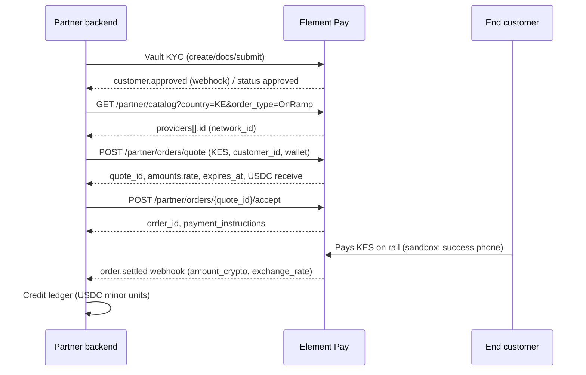

# Agent quickstart — Element Pay Partner API

Short path for coding agents and humans. Contract: [`../openapi.yaml`](../openapi.yaml). Standard local fiat ↔ USDC/USDT: [`integration-fiat-stablecoin.md`](integration-fiat-stablecoin.md). Gaps: [`KNOWN_GAPS.md`](KNOWN_GAPS.md).

## Install / auth

No SDK required. Call HTTPS JSON from your **backend**.

| Env | Base URL | API key prefix |
|-----|----------|----------------|
| **Sandbox** | `https://sandbox.elementpay.net/api/v1` | `is_test_` |
| **Production** | `https://api.elementpay.net/api/v1` | `is_live_` |

```bash
export BASE="https://sandbox.elementpay.net/api/v1"
export API_KEY="is_test_YOUR_API_KEY"
```

Every request:

```http
X-API-Key: is_test_YOUR_API_KEY
Content-Type: application/json
```

Request access: email **compliance@elementpay.net** (company, corridors, sandbox `webhook_url`). See `sandbox/onboarding.mdx`.

Security scheme in OpenAPI: `APIKeyHeader` (`X-API-Key`). Webhook HMAC uses `webhook_secret` on the key — not request auth.

## Sandbox credentials / test amounts

| Item | Value | Notes |
|------|-------|-------|
| API key | `is_test_YOUR_API_KEY` | Provisioned by Element Pay |
| Webhook secret | `YOUR_WEBHOOK_SECRET` | HMAC verify |
| KE momo success phone | `+2541111111111` | **Sandbox only** |
| KE momo failure phone | `+2540000000000` | **Sandbox only** |
| Example OnRamp amount | `local_amount: 800` (KES) | Matches guide examples |
| Default asset | Base USDC `0x833589fcd6edb6e08f4c7c32d4f71b54bdA02913` | Same address sandbox + prod |

Never send sandbox phones/`1111111111` accounts on **production**. Full matrix: `sandbox/success-failure.mdx`.

## Happy path — local fiat → USDC (OnRamp)

Same endpoints for every corridor: discover → quote → accept → `order.settled`. Only `country` / `currency` / `network_id` / amount / asset change. OffRamp (crypto → local) is documented in [`integration-fiat-stablecoin.md`](integration-fiat-stablecoin.md).

Worked example below: **KE M-PESA OnRamp → Base USDC** (fund portal: credit ledger on settle).



### Numbered steps (copy-pasteable)

**0. Env**

```bash
export BASE="https://sandbox.elementpay.net/api/v1"
export API_KEY="is_test_YOUR_API_KEY"
```

**1. KYC (required)** — every end-customer needs vault `customer_id` (`pcus_*`) with `status=approved` before quote. Full curls: `customers/quickstart.mdx`. Minimal flow:

1. `GET /partner/customers/requirements`
2. `POST /partner/customers` → save `pcus_*`
3. `POST /partner/customers/{customer_id}/documents` (identity + address)
4. `POST /partner/customers/{customer_id}/submit`
5. Wait for `customer.approved` webhook or poll `GET /partner/customers/{customer_id}` until `status` is `approved`

```bash
export CUSTOMER_ID="pcus_YOUR_APPROVED_CUSTOMER"
```

**2. Discover M-PESA `network_id`** (do not hardcode across envs)

```bash
curl -sS "$BASE/partner/catalog?country=KE&order_type=OnRamp" \
  -H "X-API-Key: $API_KEY" \
  | jq '.data.onramp.countries.KE.payment_methods.mobile_money.providers[] | {id, name}'
```

**3. Quote** — OpenAPI: `POST /partner/orders/quote`

```bash
curl -sS -X POST "$BASE/partner/orders/quote" \
  -H "X-API-Key: $API_KEY" \
  -H "Content-Type: application/json" \
  -d '{
    "order_type": "OnRamp",
    "currency": "KES",
    "country": "KE",
    "local_amount": 800,
    "customer_id": "'"$CUSTOMER_ID"'",
    "asset": {
      "token": "0x833589fcd6edb6e08f4c7c32d4f71b54bdA02913",
      "currency": "USDC",
      "network": "BASE"
    },
    "payment_method": {
      "type": "mobile_money",
      "phone_number": "+2541111111111",
      "network_id": "REPLACE_FROM_CATALOG"
    },
    "wallet_address": "0xde0B295669a9FD93d5F28D9Ec85E40f4cb697BAe"
  }' | tee /tmp/quote.json | jq '{quote_id: .data.quote_id, expires_at: .data.expires_at, amounts: .data.amounts}'

export QUOTE_ID=$(jq -r '.data.quote_id' /tmp/quote.json)
```

**4. Accept** (wait ~2s; OpenAPI: `POST /partner/orders/{quote_id}/accept`)

```bash
sleep 2
curl -sS -X POST "$BASE/partner/orders/$QUOTE_ID/accept" \
  -H "X-API-Key: $API_KEY" \
  -H "Content-Type: application/json" \
  -d '{}' | tee /tmp/accept.json | jq '.data | {quote_id, status, order: .order.order_id, payment_instructions}'

export ORDER_ID=$(jq -r '.data.order.order_id' /tmp/accept.json)
```

**5. Settle** — prefer webhook `order.settled`; backup poll:

```bash
curl -sS "$BASE/partner/orders/$ORDER_ID" -H "X-API-Key: $API_KEY" | jq '.data'
```

Then credit your fund-portal ledger with `amount_crypto` (API returns decimal stablecoin; store as integer minor units × 10⁶ if that is your ledger convention). Details: [`integration-fiat-stablecoin.md`](integration-fiat-stablecoin.md).

## Webhook verify + idempotency

Headers (every delivery):

```http
X-Webhook-Event: order.settled
X-Webhook-Id: <uuid>
X-Webhook-Signature: t=<unix_ts>,v1=<base64_signature>
```

Verify (from `webhooks.mdx`):

1. Parse `t=…,v1=…`
2. Reject if `t` older than **5 minutes**
3. HMAC-SHA256 over `{t}.{raw_body}` with `YOUR_WEBHOOK_SECRET`; constant-time compare to `v1`
4. Dedupe on **`X-Webhook-Id`**; return **2xx** quickly

Order events: `order.processing` → `order.settled` | `order.failed` | `order.refunded`.

**Idempotency elsewhere**

| Surface | Mechanism |
|---------|-----------|
| Webhooks | `X-Webhook-Id` |
| Quote accept | `409` if already accepted — use existing `order_id` |
| Banking sends / book / conversions / payouts | request body `idempotency_key` |

Corridor quotes do **not** take an `idempotency_key` on quote/accept.

## Common pitfalls

1. Quoting before vault `status=approved` → `422`
2. Hardcoding `network_id` from docs instead of **your** catalog
3. Using sandbox success phones on **production**
4. Treating `GET /partner/rates/indicative` as the binding FX (it is **not**; use quote `amounts.rate`)
5. Confusing corridor OnRamp with ledger `…/conversions` (fiat↔fiat on banking accounts only)
6. Crediting the user ledger on accept/`order.processing` instead of **`order.settled`**
7. Missing webhook signature check or clock skew / replay beyond 5 minutes
8. Reusing OffRamp crypto deposit addresses across orders (per-order in production)

## OpenAPI path map (this happy path)

| Step | Method | Path |
|------|--------|------|
| Requirements | `GET` | `/partner/customers/requirements` |
| Create customer | `POST` | `/partner/customers` |
| Upload docs | `POST` | `/partner/customers/{customer_id}/documents` |
| Submit | `POST` | `/partner/customers/{customer_id}/submit` |
| Get customer | `GET` | `/partner/customers/{customer_id}` |
| Catalog | `GET` | `/partner/catalog` |
| Quote | `POST` | `/partner/orders/quote` |
| Accept | `POST` | `/partner/orders/{quote_id}/accept` |
| Poll order | `GET` | `/partner/orders/{order_id}` |
| Indicative FX (UI only) | `GET` | `/partner/rates/indicative` |

All listed under `paths` in `openapi.yaml`.
